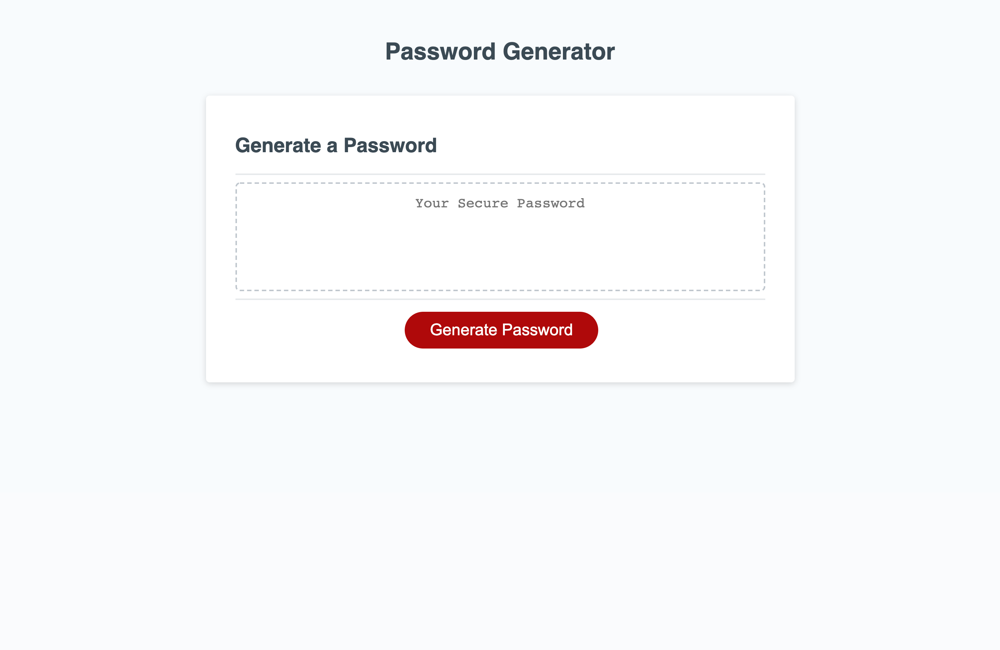

# Password Generator
​
A webpage for generating a random password based on criteria user have selected
​
## Technologies Used

* HTML
* CSS
* JavaScript
## Description 
​
This application creates a secure password. The user selects password's length and different types of characters for his or her password. Then, randomly generated password appears on the screen.

## Usage 
​
Press "Generate Password" button to get your random pass.

## Page View

## Link
Link to deployed application https://irina-golubitsky.github.io/password-generator/

---
MIT License
Copyright (c) [2021] [Irina Golubitsky]
